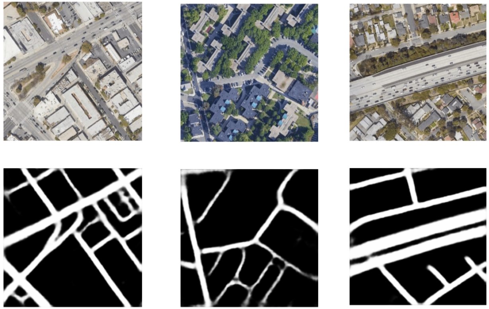

# Road Segmentation: HighwayToCIL

<p align="center">
  
</p>

This repository contains the developed code for the Road Segmentation Project of the Computational Intelligence Lab 2023.

## Get Started

The easiest way to get started is to create a `conda` environment. [Here](https://docs.anaconda.com/free/anaconda/install/index.html) is a guide to install Anaconda. Once installed run the following:

```bash
conda create -n cil python=3.11
conda activate cil
conda install pytorch torchvision torchaudio pytorch-cuda=11.7 -c pytorch -c nvidia
pip install -r requirements.txt
```


## Run the models

In order to run the different models, you can use the `run.py` script:

```bash
python3 run.py ACTION MODEL FLAGS
```

| ACTION      | Description |
| ----------- | ----------- |
| train       | trains the specified model|
| predict     | predicts segmentation masks for the provided images |


| MODEL       | 
| ----------- | 
| Unet        |
| ResUnet     |
| LinkNet34   | 
| DLinkNet34  | 
| DLinkNet101 | 
| NL_DLinkNet34   | 
| DLinkNet101_JPU | 

| FLAGS for ACTION **train** | Description       |
| ---------------------- | ----------------- |
| --data_path            | specify where the data for training is located |
| --loss                 | specify the loss, options = {"BCE", "FocalLoss", "HybridLoss"} |
| --num_epochs           | specify the maximum number of epochs to train   | 
| --batch_size           | specify the batch size to train on  |

| FLAGS for ACTION **predict** | Description       |
| ---------------------- | ----------------- |
| --data_path            | specify where the data to segment is located |
| --checkpoint           | specify the checkpoint for the model |
| --ensemble             | specify if ensembling should be used |

Examples: 
1. Train the Unet using the BinaryCrossEntropyLoss for a maximum of 100 epochs with batch size 8:
```bash
python3 run.py train Unet --data_path dataset/kaggle --loss BCE --num_epochs 100 --batch_size 8
```
2. Predict segmentation masks using the NL_DLinkNet34 and DLinkNet34 in ensemble mode
```bash
python3 run.py predict DLinkNet34 NL_DLinkNet34 --data_path dataset/kaggle/test/images --checkpoint checkpoints/checkpoint_DLinkNet34.pth checkpoints/checkpoint_NL_DLinkNet34.pth--ensemble
```

